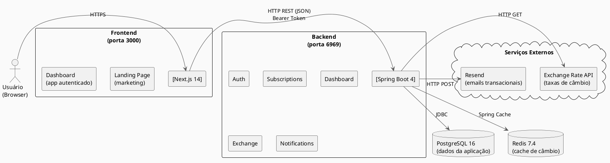
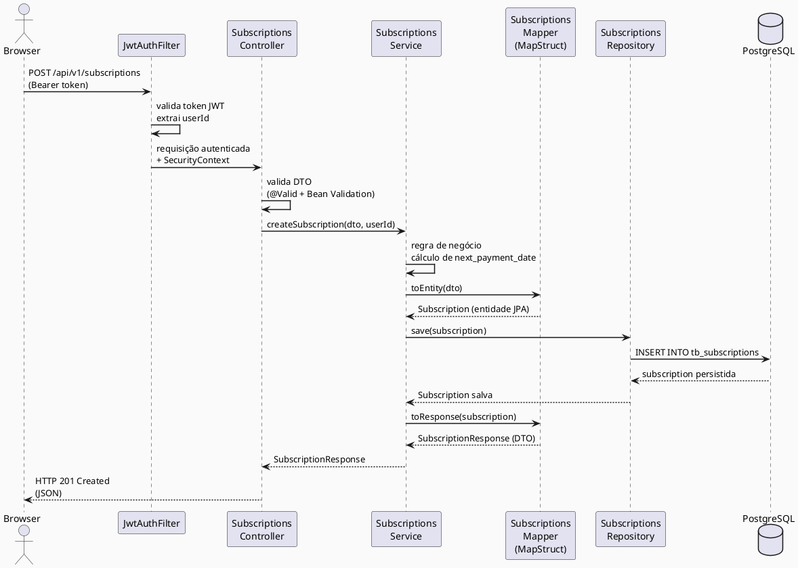
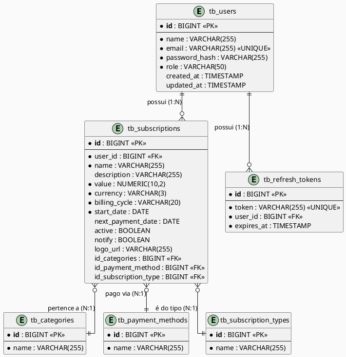

# Documento de Visão — Ongoing

**Versão:** 1.0  
**Data:** 2026-04-30  
**Autor:** Guilherme Luan  
**Status:** Em desenvolvimento  

---

## Histórico de Revisões

| Versão | Data | Autor | Descrição |
|--------|------|-------|-----------|
| 1.0 | 2026-04-30 | Guilherme Luan | Versão inicial do documento |

---

## Sumário

1. [Introdução](#1-introdução)
   - 1.1 [Finalidade](#11-finalidade)
   - 1.2 [Escopo](#12-escopo)
   - 1.3 [Definições, Sinônimos e Abreviações](#13-definições-sinônimos-e-abreviações)
   - 1.4 [Referências](#14-referências)
2. [Contextualização](#2-contextualização)
   - 2.1 [Descrição do Problema](#21-descrição-do-problema)
   - 2.2 [Sentença do Produto](#22-sentença-do-produto)
3. [Identificação dos Stakeholders e Usuários](#3-identificação-dos-stakeholders-e-usuários)
   - 3.1 [Principais Stakeholders e Usuários](#31-principais-stakeholders-e-usuários)
   - 3.2 [Necessidades Chave dos Stakeholders e Usuários](#32-necessidades-chave-dos-stakeholders-e-usuários)
4. [Visão Geral do Produto](#4-visão-geral-do-produto)
   - 4.1 [Perspectiva do Produto](#41-perspectiva-do-produto)
   - 4.2 [Resumo das Funcionalidades](#42-resumo-das-funcionalidades)
   - 4.3 [Estimativa de Custo Inicial](#43-estimativa-de-custo-inicial)
   - 4.4 [Suposições e Dependências](#44-suposições-e-dependências)
5. [Requisitos Funcionais e Prioridades](#5-requisitos-funcionais-e-prioridades)
6. [Requisitos Não-Funcionais](#6-requisitos-não-funcionais)
7. [Restrições](#7-restrições)
8. [Manual de Arquitetura](#8-manual-de-arquitetura)
   - 8.1 [Visão de Implementação](#81-visão-de-implementação)
   - 8.2 [Mecanismos Arquiteturais](#82-mecanismos-arquiteturais)
9. [Dicionário de Dados](#9-dicionário-de-dados)

---

## 1. Introdução

### 1.1 Finalidade

Este documento descreve a visão do produto **Ongoing**, uma plataforma full-stack de gerenciamento de assinaturas recorrentes. O objetivo é fornecer uma visão unificada do sistema para stakeholders, desenvolvedores e demais partes interessadas, definindo escopo, funcionalidades, requisitos e arquitetura do produto.

### 1.2 Escopo

O **Ongoing** é uma aplicação web composta por:

- **API REST** (backend) para gerenciamento de assinaturas recorrentes, autenticação de usuários e agregação de dados para o dashboard
- **Aplicação web** (frontend) com página de marketing (landing page) e dashboard autenticado para gerenciamento e visualização das assinaturas

O sistema permite ao usuário cadastrar, visualizar, editar e remover assinaturas de serviços recorrentes (streaming, SaaS, academias, seguros, etc.), acompanhar gastos mensais e anuais com conversão automática de moedas, e futuramente receber alertas antes de cada cobrança.

Estão **fora do escopo** desta versão:

- Integração direta com gateways de pagamento para cobrança automática
- Aplicativos móveis nativos (iOS/Android)
- Importação automática de extratos bancários

### 1.3 Definições, Sinônimos e Abreviações

| Termo | Definição |
|-------|-----------|
| **Assinatura** | Serviço recorrente com cobrança periódica (ex.: Netflix, Spotify) |
| **Ciclo de Cobrança** | Periodicidade da renovação: Mensal, Trimestral, Semestral, Anual, Semanal, Quinzenal |
| **Dashboard** | Painel com métricas consolidadas de gastos do usuário |
| **JWT** | JSON Web Token — mecanismo de autenticação stateless |
| **Multi-tenant** | Cada usuário acessa apenas seus próprios dados |
| **BRL / USD / EUR** | Moedas suportadas: Real brasileiro, Dólar americano, Euro |
| **API** | Application Programming Interface |
| **REST** | Representational State Transfer — estilo arquitetural da API |
| **CI/CD** | Continuous Integration / Continuous Delivery |
| **ORM** | Object-Relational Mapping |
| **DTO** | Data Transfer Object — objeto de transporte de dados entre camadas |

### 1.4 Referências

| Documento | Localização |
|-----------|-------------|
| Arquitetura e padrões do projeto | `CLAUDE.md` |
| Guia técnico completo do projeto | `docs/FOR-Guilherme.md` |
| Design: Módulo de Dashboard | `docs/plans/2026-02-03-dashboard-module-design.md` |
| Design: Autenticação JWT | `docs/plans/2026-01-29-jwt-authentication-design.md` |
| Design: Notificações por Email | `docs/plans/2026-02-17-email-renewal-reminders-design.md` |
| Design: Cache com Redis | `docs/plans/2026-02-25-cache-subscriptions-dashboard-design.md` |
| Padrões de Mensageria | `docs/mensageria.md` |

---

## 2. Contextualização

### 2.1 Descrição do Problema

Com a proliferação de serviços por assinatura nos últimos anos, é cada vez mais comum que uma pessoa tenha 5, 10 ou até 15 assinaturas ativas simultaneamente — streaming de vídeo, música, cloud storage, ferramentas SaaS, academias, seguros e outros. Esse cenário cria um problema concreto: **falta de visibilidade e controle sobre os gastos recorrentes**.

Os principais problemas identificados são:

| Problema | Impacto | Afeta |
|----------|---------|-------|
| Dificuldade em listar todas as assinaturas ativas | O usuário não sabe quanto gasta mensalmente | Usuário final |
| Cobranças inesperadas por falta de aviso prévio | Frustração e gastos não planejados no orçamento | Usuário final |
| Falta de visão consolidada por categoria de gasto | Impossibilidade de tomar decisões de corte de custos | Usuário final |
| Assinaturas em múltiplas moedas sem conversão | Dificuldade de calcular o total real em BRL | Usuário brasileiro |
| Assinaturas esquecidas continuam sendo cobradas | Desperdício de dinheiro em serviços não utilizados | Usuário final |

### 2.2 Sentença do Produto

**Para** pessoas físicas que assinam múltiplos serviços recorrentes,  
**que** perdem controle sobre seus gastos mensais e são surpreendidas por cobranças inesperadas,  
**o Ongoing** é uma plataforma web de gerenciamento de assinaturas  
**que** centraliza todas as assinaturas em um único lugar, fornece visão consolidada de gastos com conversão automática de moedas e alertas antes de cada renovação.  
**Diferente de** planilhas ou anotações manuais,  
**o nosso produto** oferece uma interface intuitiva, dados em tempo real e notificações automatizadas.

---

## 3. Identificação dos Stakeholders e Usuários

### 3.1 Principais Stakeholders e Usuários

| Papel | Descrição | Envolvimento |
|-------|-----------|--------------|
| **Usuário Final** | Pessoa física que gerencia suas próprias assinaturas | Usuário direto do sistema |
| **Desenvolvedor / Mantenedor** | Guilherme Luan — responsável pelo desenvolvimento e manutenção | Proprietário do produto |
| **Exchange Rate API** | Serviço externo de taxas de câmbio (exchangerate-api.com) | Dependência externa |
| **Resend** | Serviço externo de envio de emails transacionais | Dependência externa |
| **Railway** | Plataforma de hospedagem (backend + banco de dados em produção) | Infraestrutura de produção |
| **Neon** | Banco de dados PostgreSQL gerenciado em produção | Infraestrutura de dados |

### 3.2 Necessidades Chave dos Stakeholders e Usuários

| Necessidade | Prioridade | Solução Atual |
|-------------|------------|---------------|
| Listar todas as assinaturas ativas | Alta | CRUD completo de assinaturas implementado |
| Visualizar total de gastos do mês | Alta | Dashboard com métricas implementado |
| Acompanhar projeção anual de gastos | Alta | Dashboard com cálculo anual implementado |
| Ver gastos por categoria (streaming, SaaS, etc.) | Média | Dashboard com breakdown por categoria |
| Saber quando cada assinatura renova | Alta | Campo `next_payment_date` por assinatura |
| Receber alerta antes de uma cobrança | Alta | Em desenvolvimento (módulo de notificações) |
| Ter dados em múltiplas moedas convertidos para BRL | Alta | Conversão automática via Exchange Rate API + Redis |
| Acessar o sistema com segurança por conta própria | Alta | Autenticação JWT com access + refresh token |
| Organizar assinaturas por categorias | Média | Categorias pré-definidas no sistema |

---

## 4. Visão Geral do Produto

### 4.1 Perspectiva do Produto

O **Ongoing** é uma plataforma web independente, composta por dois sistemas integrados:



O frontend se comunica exclusivamente com o backend via API REST. O backend é responsável por toda a lógica de negócio, persistência e integração com serviços externos.

### 4.2 Resumo das Funcionalidades

| ID | Funcionalidade | Status |
|----|----------------|--------|
| F01 | Cadastro de usuário (self-service) | Implementado |
| F02 | Login com JWT (access + refresh token) | Implementado |
| F03 | Criação de assinatura | Implementado |
| F04 | Listagem de assinaturas do usuário | Implementado |
| F05 | Edição de assinatura | Implementado |
| F06 | Exclusão de assinatura | Implementado |
| F07 | Dashboard com total do mês | Implementado |
| F08 | Dashboard com média mensal | Implementado |
| F09 | Dashboard com projeção anual | Implementado |
| F10 | Dashboard com gastos por categoria | Implementado |
| F11 | Conversão automática USD/EUR → BRL | Implementado |
| F12 | Cache de taxas de câmbio (Redis) | Implementado |
| F13 | Notificações por email antes da renovação | Em desenvolvimento |
| F14 | Filtros e paginação de assinaturas | Planejado |
| F15 | Customização de logos dos serviços | Planejado |

### 4.3 Estimativa de Custo Inicial

| Componente | Solução | Custo Estimado |
|------------|---------|----------------|
| Backend (API) | Railway | Plano gratuito / ~$5/mês |
| Banco de dados | Neon (PostgreSQL) | Plano gratuito / ~$0–19/mês |
| Frontend | Railway ou Vercel | Plano gratuito |
| Email transacional | Resend | Plano gratuito até 3.000 emails/mês |
| Exchange Rate API | exchangerate-api.com | Plano gratuito até 1.500 req/mês |
| **Total estimado** | | **$0 a $24/mês** |

### 4.4 Suposições e Dependências

**Suposições:**

- O usuário possui acesso a um navegador web moderno (Chrome, Firefox, Edge, Safari)
- O usuário sabe quais assinaturas possui e seus valores
- A aplicação é single-tenant por usuário (cada usuário gerencia apenas suas próprias assinaturas)
- Os volumes de uso se enquadram nos limites dos planos gratuitos dos serviços externos

**Dependências externas:**

| Dependência | Propósito | Criticidade |
|-------------|-----------|-------------|
| PostgreSQL | Banco de dados principal | Alta |
| Redis | Cache de taxas de câmbio | Média (degradação graciosa sem cache) |
| Exchange Rate API | Taxas de conversão de moeda | Média (conversão não disponível sem ela) |
| Resend | Envio de emails de notificação | Baixa (funcionalidade futura) |
| Railway / Neon | Infraestrutura de produção | Alta |

---

## 5. Requisitos Funcionais e Prioridades

### Módulo de Autenticação

| ID | Requisito | Prioridade |
|----|-----------|------------|
| RF01 | O sistema deve permitir que novos usuários se registrem com nome, email e senha | Alta |
| RF02 | O sistema deve autenticar usuários via email e senha, retornando access token e refresh token JWT | Alta |
| RF03 | O sistema deve renovar o access token com base no refresh token válido | Alta |
| RF04 | O sistema deve invalidar sessões ao realizar logout | Alta |
| RF05 | Todos os endpoints de assinatura e dashboard devem exigir autenticação | Alta |

### Módulo de Assinaturas

| ID | Requisito | Prioridade |
|----|-----------|------------|
| RF06 | O sistema deve permitir criar uma nova assinatura com nome, valor, moeda, ciclo de cobrança, categoria, método de pagamento e data de início | Alta |
| RF07 | O sistema deve calcular automaticamente a próxima data de pagamento com base no ciclo de cobrança | Alta |
| RF08 | O sistema deve listar todas as assinaturas do usuário autenticado | Alta |
| RF09 | O sistema deve permitir editar os dados de uma assinatura existente | Alta |
| RF10 | O sistema deve permitir excluir uma assinatura | Alta |
| RF11 | O sistema não deve permitir que um usuário acesse assinaturas de outro usuário | Alta |
| RF12 | O sistema deve suportar assinaturas em BRL, USD e EUR | Alta |

### Módulo de Dashboard

| ID | Requisito | Prioridade |
|----|-----------|------------|
| RF13 | O dashboard deve exibir o total de gastos do mês corrente em BRL | Alta |
| RF14 | O dashboard deve exibir a média mensal de gastos dos últimos 12 meses em BRL | Alta |
| RF15 | O dashboard deve exibir a projeção de gastos para os próximos 12 meses em BRL | Alta |
| RF16 | O dashboard deve exibir o total de gastos por categoria em BRL | Alta |
| RF17 | O sistema deve converter automaticamente valores em USD e EUR para BRL | Alta |
| RF18 | As taxas de câmbio devem ser armazenadas em cache (Redis) por 24 horas | Média |

### Módulo de Notificações (Planejado)

| ID | Requisito | Prioridade |
|----|-----------|------------|
| RF19 | O sistema deve enviar notificação por email X dias antes da renovação de uma assinatura | Alta |
| RF20 | O usuário deve poder ativar ou desativar notificações por assinatura | Média |

---

## 6. Requisitos Não-Funcionais

### 6.1 Desempenho

- A API deve responder a requisições de listagem em menos de **500ms** em condições normais de uso
- O cache Redis deve reduzir chamadas externas à Exchange Rate API a no máximo **1 por dia por moeda**
- A aplicação backend deve suportar pelo menos **100 requisições simultâneas** via virtual threads (Java 25)
- O dashboard deve ser renderizado no frontend em menos de **2 segundos**

### 6.2 Segurança

- Senhas devem ser armazenadas com hash seguro (BCrypt)
- Access tokens JWT devem ter tempo de expiração curto (configurável, padrão: 15–60 minutos)
- Refresh tokens devem ser armazenados no banco de dados e invalidados após uso ou logout
- A API deve implementar CORS com origens permitidas explicitamente configuradas
- A API deve implementar rate limiting (Bucket4j) para prevenir abusos
- Em produção, a API deve operar exclusivamente sobre HTTPS
- Dados de um usuário jamais devem ser expostos a outro usuário (isolamento multi-tenant por `user_id`)

### 6.3 Usabilidade

- A interface deve ser responsiva e funcionar em dispositivos móveis (iOS Safari, Android Chrome)
- O fluxo de cadastro e primeiro login deve ser completado em menos de 2 minutos
- O dashboard deve apresentar as informações mais relevantes na tela inicial sem necessidade de scroll
- Mensagens de erro devem ser claras e orientar o usuário sobre como corrigir o problema

### 6.4 Confiabilidade

- O sistema deve manter cobertura mínima de **80% de testes** (unitários + integração)
- Testes de integração devem utilizar banco de dados real (PostgreSQL via Testcontainers) para garantir fidelidade
- O pipeline de CI/CD deve bloquear deploy em caso de falha em testes
- Migrações de banco de dados devem ser versionadas e executadas automaticamente via Flyway

### 6.5 Manutenibilidade

- O código deve seguir princípios de Clean Code e separação de responsabilidades
- A estrutura do projeto deve seguir a organização package-by-feature
- Mudanças no banco de dados devem ser feitas exclusivamente via migrations Flyway
- Configurações de ambiente (credenciais, URLs) devem ser externalizadas via variáveis de ambiente

### 6.6 Documentação

- Este documento de visão deve ser mantido atualizado a cada mudança relevante no produto
- O arquivo `CLAUDE.md` deve ser atualizado a cada mudança arquitetural
- O arquivo `docs/FOR-Guilherme.md` deve registrar decisões técnicas, lições aprendidas e boas práticas

---

## 7. Restrições

| Restrição | Descrição |
|-----------|-----------|
| **Tecnologia backend** | Java 25 + Spring Boot 4 (sem substituição por outra linguagem ou framework) |
| **Tecnologia frontend** | Next.js 14 com TypeScript e Tailwind CSS |
| **Banco de dados** | PostgreSQL (sem substituição por outro SGBD) |
| **Autenticação** | JWT com access + refresh token (sem sessões server-side) |
| **Deploy** | Railway para backend; Neon para banco em produção |
| **Moedas suportadas** | BRL, USD, EUR (expansão requer alteração no constraint do banco) |
| **Escopo de usuário** | Sistema single-tenant por usuário (sem suporte a contas empresariais/equipes nesta versão) |
| **Plataforma** | Aplicação web (sem app mobile nativo nesta versão) |

---

## 8. Manual de Arquitetura

### 8.1 Visão de Implementação

O projeto é um **monorepo** com dois subsistemas independentes:

```
ongoing/
├── backend/          # Spring Boot REST API (porta 6969)
│   └── src/main/java/dev/guilhermeluan/ongoing/
│       ├── auth/         # Autenticação JWT
│       ├── user/         # Entidade e repositório de usuários
│       ├── subscriptions/# Módulo principal de assinaturas
│       ├── dashboard/    # Módulo de métricas e estatísticas
│       ├── exchange/     # Cliente de taxas de câmbio
│       ├── notification/ # Módulo de notificações (em dev)
│       ├── config/       # Configurações (Security, Redis, CORS)
│       └── exception/    # Tratamento global de erros
│
├── frontend/         # Next.js 14 (porta 3000)
│   └── src/
│       ├── app/
│       │   ├── (marketing)/  # Landing page pública
│       │   └── (app)/        # Dashboard autenticado
│       ├── components/       # Componentes React organizados por nível
│       ├── features/         # Módulos de funcionalidades
│       ├── hooks/            # Custom hooks React
│       └── lib/              # Utilitários
│
├── docs/             # Documentação do projeto
└── docker-compose.yaml  # PostgreSQL 16 + Redis 7.4 (desenvolvimento local)
```

**Fluxo de uma requisição (exemplo: criação de assinatura):**



### 8.2 Mecanismos Arquiteturais

| Mecanismo | Tecnologia | Justificativa |
|-----------|------------|---------------|
| **API REST** | Spring Boot 4 + Spring WebMVC | Padrão de mercado para APIs HTTP, suporte amplo |
| **Persistência** | Spring Data JPA + Hibernate | Abstração ORM produtiva com controle via Flyway |
| **Migrations** | Flyway | Controle de versão do schema de banco de dados |
| **Mapeamento DTO** | MapStruct | Geração de código em tempo de compilação (sem reflection em runtime) |
| **Autenticação** | JWT (JJWT) + Spring Security | Stateless, escalável, padrão para APIs modernas |
| **Cache** | Redis 7.4 via Spring Cache | Reduz chamadas externas à Exchange Rate API com TTL de 24h |
| **Concorrência** | Virtual Threads (Java 25) | Alta throughput com threads leves gerenciadas pela JVM |
| **Rate Limiting** | Bucket4j | Proteção contra abuso da API sem dependência externa |
| **Testes de integração** | Testcontainers + RestAssured | Testes com banco de dados real (PostgreSQL em Docker) |
| **CI/CD** | GitHub Actions | Pipeline automatizado de build, testes e deploy |
| **Conversão de moedas** | @HttpExchange (Spring) | Cliente HTTP declarativo para Exchange Rate API |
| **Emails transacionais** | Resend | Serviço simples com SDK Java, plano gratuito generoso |
| **Frontend SSR/CSR** | Next.js 14 App Router | Server-side rendering, rotas protegidas, performance |
| **Estilização** | Tailwind CSS | Utilitário de CSS produtivo com design system customizável |

---

## 9. Dicionário de Dados

### 9.1 Finalidade

Esta seção descreve as tabelas do banco de dados PostgreSQL utilizadas pelo sistema, com seus campos, tipos e restrições. O schema é gerenciado por migrações Flyway (em `backend/src/main/resources/db/migration/`).

### 9.2 Tabelas do Banco de Dados

#### `tb_users` — Usuários do sistema

| Campo | Tipo | Restrições | Descrição |
|-------|------|------------|-----------|
| `id` | BIGINT | PK, AUTO INCREMENT | Identificador único do usuário |
| `name` | VARCHAR(255) | NOT NULL | Nome completo do usuário |
| `email` | VARCHAR(255) | NOT NULL, UNIQUE | Email de login (único no sistema) |
| `password_hash` | VARCHAR(255) | NOT NULL | Hash BCrypt da senha |
| `role` | VARCHAR(50) | NOT NULL | Perfil: `USER` ou `ADMIN` |
| `created_at` | TIMESTAMP | DEFAULT NOW() | Data de criação da conta |
| `updated_at` | TIMESTAMP | DEFAULT NOW() | Data da última atualização |

---

#### `tb_refresh_tokens` — Tokens de renovação de sessão

| Campo | Tipo | Restrições | Descrição |
|-------|------|------------|-----------|
| `id` | BIGINT | PK, AUTO INCREMENT | Identificador único |
| `token` | VARCHAR(255) | NOT NULL, UNIQUE | Valor do refresh token (UUID) |
| `user_id` | BIGINT | NOT NULL, FK → `tb_users.id` CASCADE DELETE | Usuário dono do token |
| `expires_at` | TIMESTAMP | NOT NULL | Data e hora de expiração |

---

#### `tb_subscriptions` — Assinaturas recorrentes

| Campo | Tipo | Restrições | Descrição |
|-------|------|------------|-----------|
| `id` | BIGINT | PK, AUTO INCREMENT | Identificador único da assinatura |
| `user_id` | BIGINT | NOT NULL, FK → `tb_users.id` | Usuário dono da assinatura |
| `name` | VARCHAR(255) | NOT NULL | Nome do serviço (ex.: "Netflix") |
| `description` | VARCHAR(255) | — | Descrição opcional |
| `value` | NUMERIC(10,2) | NOT NULL | Valor cobrado por ciclo |
| `currency` | VARCHAR(3) | NOT NULL, DEFAULT `BRL`, CHECK IN (`BRL`,`USD`,`EUR`) | Moeda do valor |
| `billing_cycle` | VARCHAR(20) | NOT NULL | Frequência: `MONTHLY`, `QUARTERLY`, `SEMI_ANNUAL`, `YEARLY`, `WEEKLY`, `BIWEEKLY` |
| `start_date` | DATE | NOT NULL | Data de início da assinatura |
| `next_payment_date` | DATE | — | Data da próxima cobrança (calculada automaticamente) |
| `active` | BOOLEAN | DEFAULT `true` | Se a assinatura está ativa |
| `notify` | BOOLEAN | DEFAULT `true` | Se o usuário quer ser notificado antes da renovação |
| `logo_url` | VARCHAR(255) | — | URL do logo do serviço |
| `id_categories` | BIGINT | FK → `tb_categories.id` | Categoria da assinatura |
| `id_payment_method` | BIGINT | FK → `tb_payment_methods.id` | Método de pagamento |
| `id_subscription_type` | BIGINT | FK → `tb_subscription_types.id` | Tipo: Pago ou Trial |

---

#### `tb_categories` — Categorias de assinaturas (domínio)

| Campo | Tipo | Restrições | Descrição |
|-------|------|------------|-----------|
| `id` | BIGINT | PK, AUTO INCREMENT | Identificador único |
| `name` | VARCHAR(255) | NOT NULL | Nome da categoria |

**Valores pré-cadastrados:** Video Streaming, Music Streaming, Gaming, Software / SaaS, Education, Health & Fitness, Utilities, Insurance, Other

---

#### `tb_payment_methods` — Métodos de pagamento (domínio)

| Campo | Tipo | Restrições | Descrição |
|-------|------|------------|-----------|
| `id` | BIGINT | PK, AUTO INCREMENT | Identificador único |
| `name` | VARCHAR(255) | NOT NULL | Nome do método de pagamento |

**Valores pré-cadastrados:** Credit Card, Debit Card, PIX, Boleto, PayPal, Direct Debit

---

#### `tb_subscription_types` — Tipos de assinatura (domínio)

| Campo | Tipo | Restrições | Descrição |
|-------|------|------------|-----------|
| `id` | BIGINT | PK, AUTO INCREMENT | Identificador único |
| `name` | VARCHAR(255) | NOT NULL | Nome do tipo |

**Valores pré-cadastrados:** Paid, Trial

---

### 9.3 Diagrama de Relacionamentos (simplificado)



---

*Documento gerado em 2026-04-30. Para manter este documento atualizado, atualize-o sempre que houver mudanças relevantes de arquitetura, novas funcionalidades ou alterações no banco de dados.*
